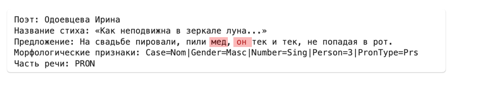

# Корпус стихов

## Описание корпуса
Корпус состоит из 6787 стихов Серебряного века 125 поэтов.\
Количество токенов: 46707.

Данные собираются в `scipts/scrape_poems.py`. Результат работы скрипта в `scipts/poems.json` со всеми стихами

Разделение на предложения реализовано с помощью RuSentTokenizer (DeepPavlov sentence tokenizer).\
Токенизация, лемматизация и определение грамматических значений происходит в `scipts/process.py` с помощью библиотеки Stanza.\
В сравнении на датасете стихов GramEval2020 Stanza показала одни из лучших результатов в морфлологии и токенизации.
В результате получаем два файла - `corpus.json` (сам корпус) и `index.json` (индекс по лемме для ускорения поиска). 

## Как использовать

## Ручной разбор ошибок
Особенность этого корпуса в нестандартном употреблении слов, в устаревших словах. Связи с этим есть ошибки в определении лемм, частей речи и т.д.
Разобрала несколько примеров ошибок [здесь](https://github.com/sofismv/poetry_corpus/blob/main/errors.md).

## Примеры

### Грамматическая омонимия
Тепло (есть обе части речи, но и присутствует ошибка)\
Третий пример сложный: принести (как?) тепло грамматически корректно, но смысла лишено

Навстречу (здесь выявилась ошибка пайплайна):

Пора (здесь тоже есть ошибка во втором примере):

### Лексическая омонимия
Лук:

Лавка:

Наряд:

### Недревесные явления (эллипсис)
Пропуск слова, понятного из контекста (другой человек):
Замечу, что "другой" связано с "заглушит" как именное подлежащее.

Опущение подлежащего-местоимения (в обоих случаях - я):

### Референциальные цепочки
В пределах фрагмента текста:

Также нашла в пределах предложения:

## Вывод

