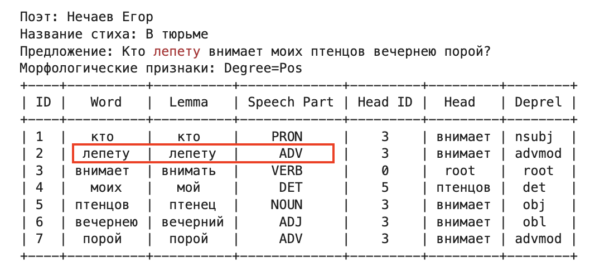
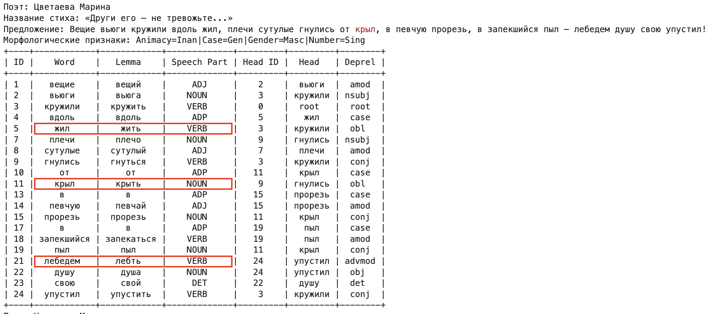
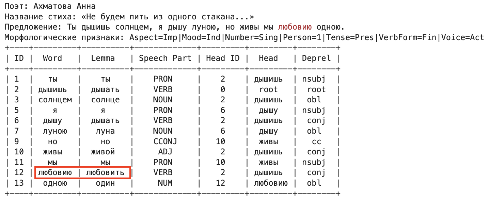
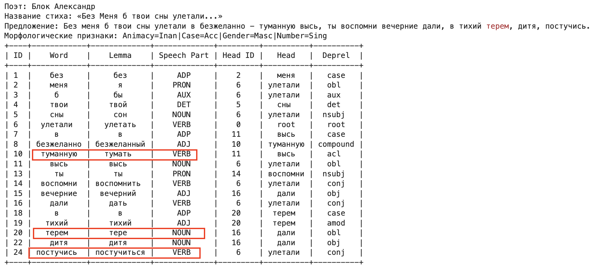
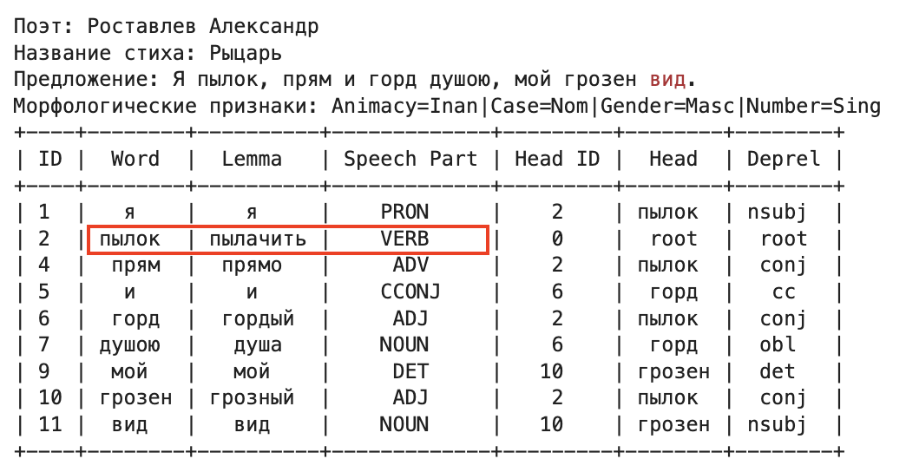
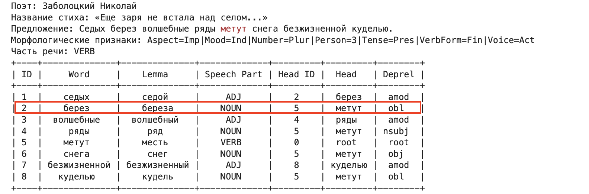
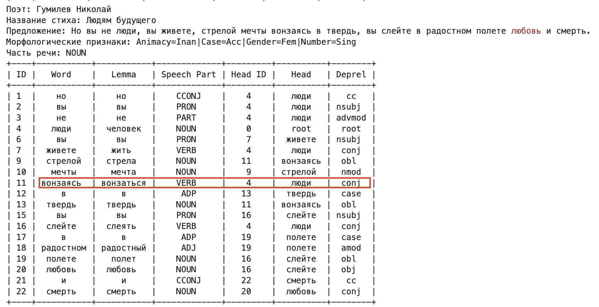

# Ручной анализ ошибок

Я просмотрела около 100 различных предложений. Ошибки, которые я встретила:

## 1. Неправильное определение леммы, части речи у распространнённых слов 
В данном примере есть существительное "лепет", употребленное в дательном падеже единственном числе.\ 
Лемматизатор определил это как наречие лепету. Поэтому нарушены и связи с этим словом.

В этом примере встречаются существительные во множественном числе родительном падеже - жил (лемма: жила), крыл (лемма: крыло) и существительное в единственном числе творительном падеже - лебедем (лемма: лебедь)\
В случае жил он спутал с глаголом жить. В случае крыл спутал с глаголом крыть, но разметил как существительное.\
В случае с лебедем он придумал лемму лебть. Моя гипотеза: похоже на глагол "что делаем?" и он сократил до инфинитива. 

## 2. Неопределенное поведение с малоизвестными словами

Поскольку в стихах встречаются редкие слова, устаревшие или немного изменённые, они не совсем хорошо размечаются, т.к. модель их не видела.

В этом примере Анна Ахматова использует "любовию" вместо "любовью", такая замена буквы приводит к тому, что лемма определяется как любовить, но такого слова не существует в природе.

Здесь есть существительное терем в винительном падеже единственного числа с начальной формой "терем". Лемма определилась как "тере". Такого слова тоже не существует.

Здесь употребляется краткая форма мужского рода единственного числа прилагательного "пылкий". Лемма определилась как "пылачить", а часть речи - глагол. Связи между словами тут тоже нарушены.

## 3. Неправильные связи между словами
В этом примере из-за сложной конструкции произошла ошибка связи: "берез" относится к "ряды", а не к "метут" (ряды берез)

В данном примере вонзаясь относится к Вы, а не к людям

